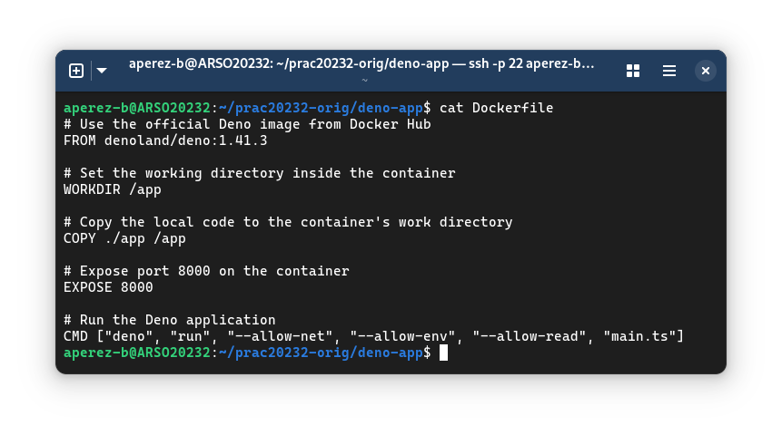

# Final Project
Alejandro Pérez Bueno
Jun 09, 2024

- [OS Setup and user creation](#os-setup-and-user-creation)
  - [Install OS into the VM](#install-os-into-the-vm)
  - [User creation](#user-creation)
- [Services stack](#services-stack)
  - [Server postgres](#server-postgres)
  - [Web Server Deno](#web-server-deno)
- [Reverse Proxy](#reverse-proxy)
- [Annexes](#annexes)



## OS Setup and user creation

### Install OS into the VM

First and foremost, we need the following:

1.  A Linux Server ISO image. I downloaded mine from here:
    <https://ubuntu.com/download/server>.
2.  A Virtualization Program. I typically use
    [`virt-manager`](https://virt-manager.org/), a well-known QEMU/KVM
    client for Linux.

You then set up the VM specifying:

- RAM usage
- CPU cores
- Virtual disk space
- Specify other hardware (input devices, GPU acceleration, USB
  redireccion)

See <a href="#fig-ubuntu-install" class="quarto-xref">Figure 1</a>.

Then we must run the ISO installer to setup:

- Language setup
- Network
- Base packages
- User creation

See <a href="#fig-live-boot" class="quarto-xref">Figure 2</a>.

> [!NOTE]
>
> The live installer has some policy that prevents uppercase characters
> in the hostname. Thus, I had to set up the correct hostname *after*
> the initial installation. See
> <a href="#fig-set-hostname" class="quarto-xref">Figure 3</a>.



#### Evidence

> [!WARNING]
>
> For ease of use, from this point on I will ssh into the guest machine
> so I can more easily manage the VM from the host. To set it up, I did
> the folloing:
>
> ``` bash
> sudo apt update
> sudo apt install ssh
> sudo nano /etc/ssh/ssh_config
> sudo ufw allow 22
> sudo systemctl enable --now ssh
> ```
>
> Line 1  
> Update repositories
>
> Line 2  
> Install `ssh`
>
> Line 3  
> Open port 22 to allow ssh on that port
>
> Line 4  
> Add firewall rule to allow ssh to go through it
>
> Line 5  
> Start ssh service and set it to start on boot
>
> Then, all I had to do is:
>
> 1.  Find guest IP (run `ip a` from guest)
> 2.  Access it from the host. See
>     <a href="#fig-ssh" class="quarto-xref">Figure 4</a>

- Host IP: *192.168.1.206*
- Guest IP: *192.168.122.175*

See <a href="#fig-ping" class="quarto-xref">Figure 5</a> to verify that
I can access the guest Ubuntu Server from my host machine.

### User creation

The simplest way to create four users and set their passwords to
automatically expire every year is with a small shell script:

<div class="code-with-filename">

**user_creation.sh**

``` bash
#!/bin/bash

for i in {1..4}
do
  username="user$(printf '%02d' $i)"
  sudo useradd $username
  echo "User $username created"

  sudo chage --maxdays 365 $username
  echo "Password for $username set to expire every year!"
done
```

</div>

Lines 3-4,11  
Loop over four users to create and modify their password policy

Line 5  
Dynamically change username to `user` + `[01..04]`

Lines 6-7  
Create user

Lines 9-10  
Set password to reset after 365 days (every year) for the previously
created user

See <a href="#fig-bash-user-year" class="quarto-xref">Figure 6 (a)</a>.

#### Evidence

<div class="code-with-filename">

**user_info.sh**

``` bash
#!/bin/bash

for i in {1..4}
do
  username="user$(printf '%02d' $i)"
  sudo chage -l $username
done
```

</div>

See <a href="#fig-bash-user-info" class="quarto-xref">Figure 6 (b)</a>.

## Services stack

### Server postgres

#### Install *docker* and *docker-compose*

Following the [official
documentation](https://docs.docker.com/engine/install/ubuntu/#installation-methods):

``` bash
# Add Docker's official GPG key:
sudo apt-get update
sudo apt-get install ca-certificates curl
sudo install -m 0755 -d /etc/apt/keyrings
sudo curl -fsSL https://download.docker.com/linux/ubuntu/gpg \
  -o /etc/apt/keyrings/docker.asc
sudo chmod a+r /etc/apt/keyrings/docker.asc

# Add the repository to Apt sources:
echo \
  "deb [arch=$(dpkg --print-architecture) \
    signed-by=/etc/apt/keyrings/docker.asc] https://download.docker.com/linux/ubuntu \
  $(. /etc/os-release && echo "$VERSION_CODENAME") stable" | \
  sudo tee /etc/apt/sources.list.d/docker.list > /dev/null
sudo apt-get update

# Install docker
sudo apt-get install docker-ce docker-ce-cli \
  containerd.io docker-buildx-plugin docker-compose-plugin

## Run a test container
sudo docker run hello-world
```

#### Configuring a service stack with docker compose

``` bash
git clone https://github.com/jestebangr/prac20232-orig.git
```

My resulting docker compose file:

<div class="code-with-filename">

**docker-compose.yaml**

``` yaml
version: '3.9'

services:
  db:
    image: postgres:16.2
    container_name: dbhost
    ports:
      - "5432:5432"
    environment:
      POSTGRES_DB: ${POSTGRES_DB}
      POSTGRES_USER: ${POSTGRES_USER}
      POSTGRES_PASSWORD: ${POSTGRES_PASSWORD}
    volumes:
      - postgres_data:/var/lib/postgresql/data
      - ./dataset/init.sql:/docker-entrypoint-initdb.d/init.sql

volumes:
  postgres_data:
```

</div>

Lines 7-8  
Add a ports configuration to expose Postgres default port (5432) to the
host

Lines 9-12  
Use environment variables to configure the database without hardcoding
sensitive information

Lines 13-14  
Define a volume to ensure data persistence

Line 15  
To load the init.sql file automatically, use the
docker-entrypoint-initdb.d directory which is automatically executed
during container startup

Lines 17-18  
Define the named volume

> [!NOTE]
>
> It is necessary to set the credentials related to postgress before
> running the docker container in an env file:
>
> <div class="code-with-filename">
>
> **.env**
>
> ``` env
> POSTGRES_DB="uoc2023"
> POSTGRES_USER="aperez-b"
> POSTGRES_PASSWORD="1234"
> ```
>
> </div>

#### Evidence

``` bash
cat docker-compose.yml
```

See
<a href="#fig-ex2-docker-compose" class="quarto-xref">Figure 7 (a)</a>.

``` bash
sudo docker ps
```

See <a href="#fig-ex2-docker-ps" class="quarto-xref">Figure 7 (b)</a>.

``` bash
sudo netstat -a | grep postgresql
```

See <a href="#fig-ex2-netstat" class="quarto-xref">Figure 7 (c)</a>.

``` bash
nmap -p- --open -n 192.168.122.175
```

See <a href="#fig-ex2-nmap" class="quarto-xref">Figure 7 (d)</a>.

``` bash
psql -h localhost -p 5432 -U aperez-b -d uoc2023
```

See <a href="#fig-ex2-psql" class="quarto-xref">Figure 7 (e)</a>.

### Web Server Deno

#### Evidence

``` bash
cat docker-compose.yml
```

See
<a href="#fig-ex2-docker-compose-2" class="quarto-xref">Figure 8 (a)</a>.

``` bash
cat Dockerfile
```

See <a href="#fig-ex2-dockerfile" class="quarto-xref">Figure 8 (b)</a>.

``` bash
sudo docker ps
```

See <a href="#fig-ex2-docker-ps-2" class="quarto-xref">Figure 8 (c)</a>.

- Webhost connection: see
  <a href="#fig-ex2-deno-web" class="quarto-xref">Figure 8 (d)</a>.

## Reverse Proxy

See <a href="#fig-ex3-http-evidence" class="quarto-xref">Figure 9</a>
and <a href="#fig-ex3-https-evidence" class="quarto-xref">Figure 10</a>.



## Annexes





